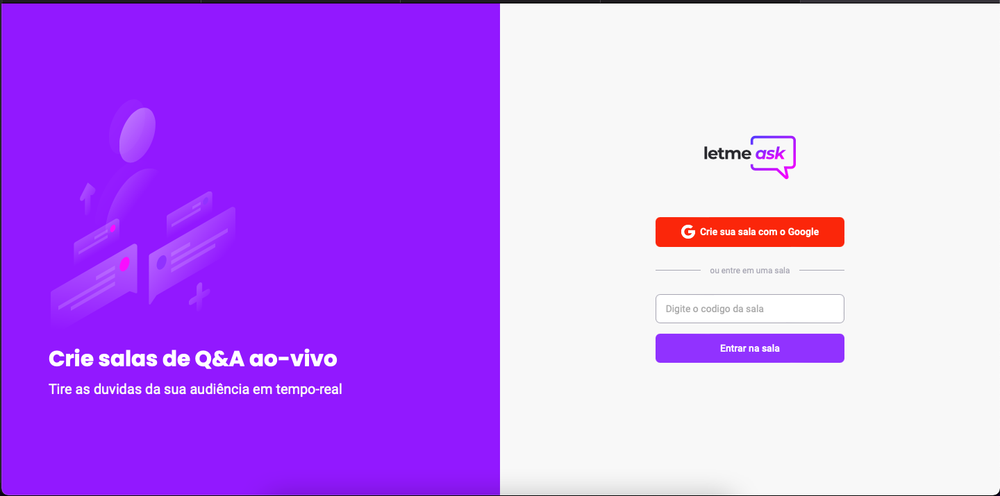

<h2  align="center">
LetmeAsk - NLW 06

</h2>

  
<p  align="center">
<a  href="#-projeto">Projeto</a>&nbsp;&nbsp;&nbsp;|&nbsp;&nbsp;&nbsp;
<a  href="#-tecnologias">Tecnologias</a>&nbsp;&nbsp;&nbsp;|&nbsp;&nbsp;&nbsp;
<a  href="#-scripts">Scripts</a>&nbsp;&nbsp;&nbsp;|&nbsp;&nbsp;&nbsp;
<a  href="#-licença">Licença</a>
</p>

  

## 💻 Projeto
  

Este projeto é uma aplicação ReactJS  de SALAS, podendo ser feito a criação com  autenticação do Google utilizando o Firebase. Onde o usuário consegue fazer as perguntas e o ADMIN da pagina marcar como respondida ate mesmo excluir e encerrar a sala.

Projeto da Rocketseat [NLW-06](https://github.com/rocketseat-education/nlw-06-reactjs/tree/aula05).

  

## 🧪 Tecnologias


O projeto foi desenvolvido usando as seguintes tecnologias:

  

- [React](https://reactjs.org)

- [TypeScript](https://www.typescriptlang.org)

- [SCSS](https://sass-lang.com/install)


  

## 📝 Scripts
Instale as dependências.

```bash

$ yarn

```

  
Para executar o projeto rode o comando abaixo.

```bash

$ yarn start 

```


    

    

## 📝 Licença 
 

This project is licensed under the MIT License. See the [LICENSE](LICENSE.md) file for details.

  ---


<p  align="center">Made with 💜 by <a  href="https://github.com/sararchh"  target="_blank">Sara Rocha</a></p>